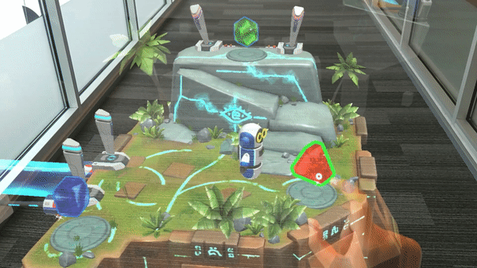

# Kippy's Escape

Kippy the robot wakes up to find itself stranded on an island… and it's up to you to solve a series of puzzles and help it find a path to its rocket ship! Kippy's Escape is an open source sample app for HoloLens 2, built with Unreal Engine and Mixed Reality [UX Tools for Unreal](https://github.com/microsoft/MixedReality-UXTools-Unreal). To learn more about the making of Kippy's Escape, check out this [article](https://docs.microsoft.com/windows/mixed-reality/kippysescape). 

Supported Unreal versions | Supported device | Built with UXT version
:-----------------: | :----------------: | :----------------------:
Unreal Engine 4.25+ | HoloLens 2 | 0.9

## How to run the app

Open up KippysEscape.uproject in Unreal Engine 4.25 or later. 

* To run the experience in-editor, select "Selected Viewport" as the Active Play Mode and press play. Two blue hands will come up that allow you to simulate hand input in the editor. Learn more about the input simulation controls provided by the UX Tools plugin [here](https://microsoft.github.io/MixedReality-UXTools-Unreal/version/public/0.9.x/Docs/InputSimulation.html). 

* To stream the experience from a PC to a HoloLens 2 headset, follow the instructions for [streaming in Unreal](https://docs.microsoft.com/en-us/windows/mixed-reality/unreal-streaming).

* To package and deploy the app to a HoloLens 2 headset, follow the instructions for [deploying to device in Unreal](https://docs.microsoft.com/en-us/windows/mixed-reality/unreal-deploying).

# Contributing

This project welcomes contributions and suggestions.  Most contributions require you to agree to a
Contributor License Agreement (CLA) declaring that you have the right to, and actually do, grant us
the rights to use your contribution. For details, visit https://cla.opensource.microsoft.com.

When you submit a pull request, a CLA bot will automatically determine whether you need to provide
a CLA and decorate the PR appropriately (e.g., status check, comment). Simply follow the instructions
provided by the bot. You will only need to do this once across all repos using our CLA.

This project has adopted the [Microsoft Open Source Code of Conduct](https://opensource.microsoft.com/codeofconduct/).
For more information see the [Code of Conduct FAQ](https://opensource.microsoft.com/codeofconduct/faq/) or
contact [opencode@microsoft.com](mailto:opencode@microsoft.com) with any additional questions or comments.
